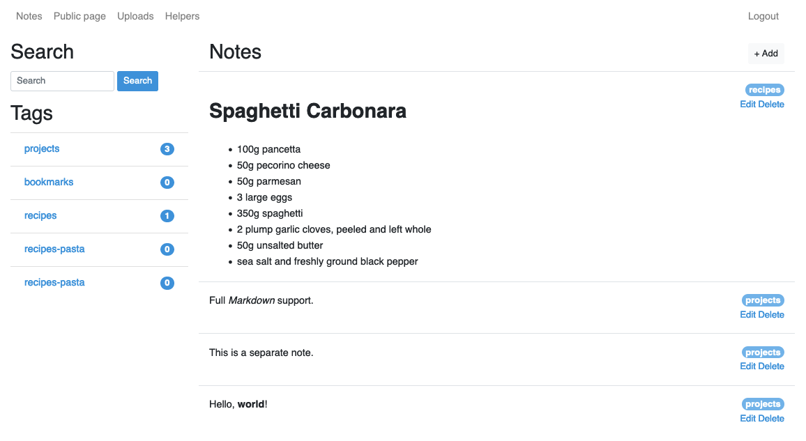

# Zero-JS note-taking web app

This started as a challenge to myself to make a full web application without any javascript - it was a success.
It was pretty usable and had a straightforward feature list: mardown support, tags, file uploads, sharing.
I eventually started using paper notebooks for daily notes and Workflowy for more structured information.
